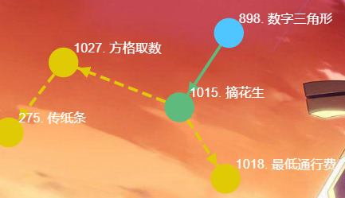

# 系列课宗旨
算法竞赛课程难度太大，不适合普及，所以该系列课程是结合自身学算法的经验，将陡峭的算法之路铺平成适合大部分人学习，类似高中数学或物理课程，老师利用经验将很难的课程讲的通俗易懂，让大部分人接受。分四个level:
+ 语法课
+ 算法基础课：算法原理、代码模板（非常重要，理解并背熟公式才能在考试时熟练写出大部分代码，因为记忆比创造知识简单，考试本质是在限时作出尽可能多的题）
+ 算法提高课：类似理科的定理和公式，熟悉基础课中代码模板的应用，以普及为目的。
+ 算法进阶课：思维难度和代码难度很高，类似奥数。
# 提高课训练
做题思路一般是：题目-阅读理解->模型-思路(题目)模型->，level3提高课就是提高后面步骤的能力，并理清题目之间的（变形和联系组成的有向图）逻辑关系，方便理解和记忆。

# 数字三角形模型
## 原理
各题目之间的逻辑关系：
，传统dp思考方法包括：阶段、决策、最优子结构、无后效性，比较麻烦和难，从集合角度来思考：
闫氏DP分析法：
+ 状态表示
  + 集合：
  + 属性：Max/Min/数量
+ 状态计算：集合的划分，通用方法是最后一步划分。

## 题目
+ [AcWing 1015. 摘花生](https://www.acwing.com/problem/content/1017/)

f[i][j]=max(f[i-1][j],f[i][j-1])+a[i][j]优化成f[j]=max(f[j],f[j-1])+a[i][j];同时将数组定义为全局，遍历时从1开始，而且能在一个循环中读取a[i][j]并算出f[j]，注意每次要将数组f重置为0
+ AcWing 1018. 最低通行费
+ AcWing 1027. 方格取数
+ AcWing 275. 传纸条

# 最长上升子序列模型
## 原理

## 题目
+ AcWing 1017. 怪盗基德的滑翔翼
+ AcWing 1014. 登山
+ AcWing 482. 合唱队形
+ AcWing 1012. 友好城市
+ AcWing 1016. 最大上升子序列和
+ AcWing 1010. 拦截导弹
+ AcWing 187. 导弹防御系统
+ AcWing 272. 最长公共上升子序列

# 背包模型
## 原理

## 题目
+ AcWing 423. 采药
+ AcWing 1024. 装箱问题
+ AcWing 1022. 宠物小精灵之收服
+ AcWing 278. 数字组合
+ AcWing 1023. 买书
+ AcWing 1021. 货币系统
+ AcWing 532. 货币系统
+ AcWing 6. 多重背包问题 III
+ AcWing 1019. 庆功会
+ AcWing 7. 混合背包问题
+ AcWing 8. 二维费用的背包问题
+ AcWing 1020. 潜水员
+ AcWing 1013. 机器分配
+ AcWing 426. 开心的金明
+ AcWing 10. 有依赖的背包问题
+ AcWing 11. 背包问题求方案数
+ AcWing 12. 背包问题求具体方案
+ AcWing 734. 能量石
+ AcWing 487. 金明的预算方案

# 状态机模型
## 原理

## 题目
+ AcWing 1049. 大盗阿福
+ AcWing 1057. 股票买卖 IV
+ AcWing 1058. 股票买卖 V
+ AcWing 1052. 设计密码
+ AcWing 1053. 修复DNA

# 状态压缩DP
## 原理

## 题目
+ AcWing 1064. 小国王
+ AcWing 327. 玉米田
+ AcWing 292. 炮兵阵地
+ AcWing 524. 愤怒的小鸟
+ AcWing 529. 宝藏

# 区间DP
## 原理

## 题目
+ AcWing 1068. 环形石子合并
+ AcWing 320. 能量项链
+ AcWing 479. 加分二叉树
+ AcWing 1069. 凸多边形的划分
+ AcWing 321. 棋盘分割

# 树形DP
## 原理

## 题目
+ AcWing 1072. 树的最长路径
+ AcWing 1073. 树的中心
+ AcWing 1075. 数字转换
+ AcWing 1074. 二叉苹果树
+ AcWing 323. 战略游戏
+ AcWing 1077. 皇宫看守

# 数位DP
## 原理

## 题目
+ AcWing 1081. 度的数量
+ AcWing 1082. 数字游戏
+ AcWing 1083. Windy数
+ AcWing 1084. 数字游戏 II
+ AcWing 1085. 不要6
+ AcWing 1086. 恨7不成妻

# 单调队列优化DP
## 原理

## 题目
+ AcWing 135. 最大子序和
+ AcWing 1087. 修剪草坪
+ AcWing 1088. 旅行问题
+ AcWing 1089. 烽火传递
+ AcWing 1090. 绿色通道
+ AcWing 1091. 理想的正方形

# 斜率优化DP
## 原理

## 题目
+ AcWing 300. 任务安排
+ AcWing 301. 任务安排
+ AcWing 302. 任务安排
+ AcWing 303. 运输小猫